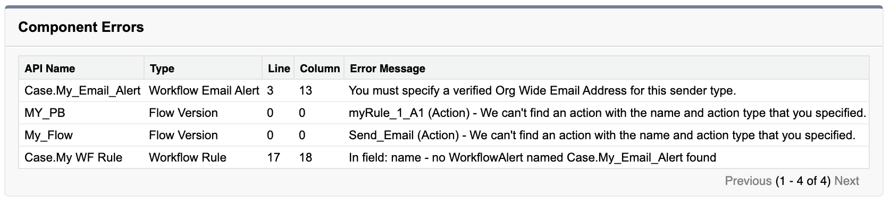

# Org Wide Email Address

Org Wide Email Address is an unsupported metadata type:  
https://developer.salesforce.com/docs/atlas.en-us.api_meta.meta/api_meta/meta_unsupported_types.htm

It can be created as data though (but no way to set the email as validated):  
https://developer.salesforce.com/docs/atlas.en-us.api.meta/api/sforce_api_objects_orgwideemailaddress.htm

It was possible before to validate it due to a bug that was fixed:  
https://success.salesforce.com/0D53A000043KVUw

To create a Scratch Org, run the [setupScratchOrg.sh](./setupScratchOrg.sh) script.  
As the Org Wide Email Address isn't validated, the Email Alert creation will fail, and so will all the metadata having dependency on this Email Alert:  
